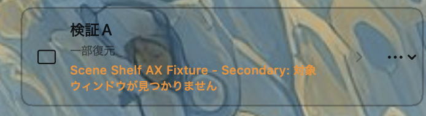

# P1-3 A→B scene switching evidence

対象: `Scene Shelf` Phase 1 P1-3 scene switching
正本: GitHub Issue #1 AT-5 / AT-10（Plan revision 1）
設計判断: [`DR-014`](../../decision-records/DR-014-p1-3-scene-switching.md)

## 実装境界

- A表示中にBカードをクリックした場合、`InMemorySceneStore`が1つのglobal busy区間でA hide→B displayを直列実行する。
- A hideが完全成功しなければBを実行せず、Aの対象別report/state/currentSceneIDと成功したhideを保持する。
- A hide成功後のB display partial/failedは、A stashedと既存report規則に従うB state/currentSceneIDを保持する。
- UIは返却outcomeのscene IDから実際に失敗したsceneのreportを取得し、A退避失敗時は「現在のシーンをしまえなかったため、切り替えを中止しました」と表示する。
- same-card、legacy bool executor、missing targetの既存境界は維持する。

## TDD Red

production変更前に`SceneShelfSwitchingTestRunner`を追加し、旧実装で次を実行した。

```text
CLANG_MODULE_CACHE_PATH="$PWD/.build-p1-3-red/module-cache" \
SWIFT_MODULECACHE_PATH="$PWD/.build-p1-3-red/swift-cache" \
swift run --disable-sandbox --scratch-path "$PWD/.build-p1-3-red/spm" \
  SceneShelfSwitchingTestRunner
```

Red証跡: focused runnerはcompile後、A→B成功・A hide partial/failed・B display partial/failedの期待で18 assertion failuresとなった。global busy、same-card、missing targetは旧契約どおりPASSした。これは切替順序と失敗時中止が未実装であることを示すbehavioral Redであり、既定SwiftPMキャッシュの権限／toolchain mismatchは専用cacheへ切り替えて排除した。

## TDD Green

実装後、同じfocused runnerを専用module-cache/scratchで再実行し、次の9件がPASSした。

| ケース | 結果 |
|---|---|
| A hide成功→B display成功 | PASS |
| A hide partial→B未操作で中止 | PASS |
| A hide failed→B未操作で中止 | PASS |
| B display partial | PASS |
| B display failed | PASS |
| A hideからB displayまでglobal busy | PASS |
| same-card往復 | PASS |
| legacy bool executor切替失敗 | PASS |
| missing target | PASS |

出力: `SceneShelfSwitchingTestRunner: 9 tests passed`。

## T4 review finding and correction

T4レビューで、A hide失敗後にAが`failed` stateでも`currentSceneID == A`として残る場合、既存delete契約の「failedは削除可」だけを適用すると、画面に一部残るactive Aをconfirmed deleteできるWarningを確認した。

先に`P1-3-TC-010`を`test-matrix.md`とfocused runnerへ追加し、旧実装で次を実行した。

```text
CLANG_MODULE_CACHE_PATH="$PWD/.build-p1-3-t4-red/module-cache" \
SWIFT_MODULECACHE_PATH="$PWD/.build-p1-3-t4-red/swift-cache" \
swift run --disable-sandbox --scratch-path "$PWD/.build-p1-3-t4-red/spm" \
  SceneShelfSwitchingTestRunner
```

Red結果: 追加ケースは5 assertion failuresとなった。旧実装がdeleteを通し、Aの`sceneActive`拒否、Aのreport/state/current、Bのstashed、scene一覧維持を満たさないことを確認した。

最小修正として、`delete`の`.failed`分岐で`currentSceneIDValue == sceneID`の場合だけ`SceneManagementError.sceneActive`を返すようにした。`currentSceneID == nil`の通常failed sceneは従来どおりconfirmed delete可能であり、Management runnerの既存契約を維持する。

修正後のfocused Greenは次のとおり。

```text
SceneShelfSwitchingTestRunner: 10 tests passed
```

追加ケースの観測契約は、A deleteが`sceneActive`で拒否され、Aのstate/report/current、Bのstashed、scene一覧が維持されることである。

## 回帰検証

専用module-cache/scratchでstrict concurrencyを付けて実行し、全てexit 0だった。

| 検証 | 結果 |
|---|---|
| `swift build --disable-sandbox ... -Xswiftc -strict-concurrency=complete` | PASS |
| `swift test --disable-sandbox ... -Xswiftc -strict-concurrency=complete` | PASS |
| `SceneShelfCoreTestRunner` | 6/6 PASS |
| `SceneShelfAXTestRunner` | 10/10 PASS |
| `SceneShelfRoundTripTestRunner` | 8/8 PASS |
| `SceneShelfP0FourTestRunner` | 12/12 PASS |
| `SceneShelfPresentationTestRunner` | 8/8 PASS |
| `SceneShelfPersistenceTestRunner` | 12/12 PASS |
| `SceneShelfManagementTestRunner` | 12/12 PASS |
| `SceneShelfSwitchingTestRunner` | 9/9 PASS |

## T4修正後の再検証

T4修正後、strict concurrencyで全targetを再ビルド・再テストし、既存runnerを含めて次を確認した。

| 検証 | 結果 |
|---|---|
| `swift build --disable-sandbox ... -Xswiftc -strict-concurrency=complete` | PASS |
| `swift test --disable-sandbox ... -Xswiftc -strict-concurrency=complete` | PASS |
| `SceneShelfCoreTestRunner` | 6/6 PASS |
| `SceneShelfAXTestRunner` | 10/10 PASS |
| `SceneShelfRoundTripTestRunner` | 8/8 PASS |
| `SceneShelfP0FourTestRunner` | 12/12 PASS |
| `SceneShelfPresentationTestRunner` | 8/8 PASS |
| `SceneShelfPersistenceTestRunner` | 12/12 PASS |
| `SceneShelfManagementTestRunner` | 12/12 PASS |
| `SceneShelfSwitchingTestRunner` | 10/10 PASS |

T4修正ではコードを変更したため、T4 post-implementation-refactorとQGは引き続き別工程であり未実施である。アプリ再build/relaunch、Accessibility設定変更、commit/push、Issue更新は行っていない。

## 自動検証の境界

- focused runnerはCore actor、report/state/currentSceneID、executor順序を検証する。
- UIのstatus文字列・カード上の理由表示、実AX adapterによる別process FixtureのA→B操作、アプリ起動／前面化、複数display、VoiceOverはこの証跡ではPASSを主張しない。
- T4 post-implementation-refactor、QG、アプリlaunch/relaunch、Accessibility設定変更、commit/push、Issue更新は本P1-3作業範囲外である。

## AT-5 手動受け入れ更新（2026-09-26 JST）

修正版relaunch後、ユーザーが「検証A」をクリックしてAの保存位置へ復元し、そのまま「検証B」をクリックした。MainがBの保存位置へ移動し、B表示中となることを確認したため、A→B scene switchingをmanual PASSとした。

## AT-6 手動受け入れ更新（2026-09-26 JST）

「検証B」を再クリックして退避済み（stashed）に戻し、Fixture MainのボタンでSecondaryを閉じた。その後「検証A」をクリックすると、MainがAの保存位置へ復元された。スクリーンショット上、カード状態は「一部復元」、メッセージは「Scene Shelf AX Fixture - Secondary: 対象ウィンドウが見つかりません」と表示されている。

この対象欠落を伴うpartial restoreの報告とMain復元をユーザー確認したため、AT-6をmanual PASSとした。



## AT-10 手動受け入れ更新（2026-09-26 JST）

「検証A」と「検証B」を高速に交互で5〜6回クリックした。最終的に「検証A」のみが表示中となり、Fixture MainはAの保存位置で停止した。操作中に固まりや終了は発生せず、ユーザーが「問題なし」と確認したため、AT-10をmanual PASSとした。

## 保存済み配置カードのクリック領域（2026-09-26 JST）

実機報告「保存カードの反応範囲が狭い」に対するD16/`DR-016`の修正を、保存カードの主要部Button labelへ適用した。`SceneShelfCardPrimaryLabel`がpadding後に`frame(maxWidth: .infinity, minHeight: 44)`と`contentShape(Rectangle())`を設定し、カード主要部の視覚領域をhit shapeへ含める。管理用「…」Menuは兄弟viewとして残し、外側HStackへgestureは追加していない。

### TDD証跡

- Red: production component追加前に`SceneShelfPresentationTestRunner`へUX-TC-001〜003相当のNSHostingView/hitTestテストを追加し、`SceneShelfCardPrimaryLabel`未定義のcompile errorで停止した。これは意図したcompile Redであり、環境エラーとは区別した。
- Green: component実装後、focused `SceneShelfPresentationTestRunner`は`SceneShelfPresentationTestRunner: 9 tests passed`。44pt minimum、Menu手前のprimary whitespace hit、Menu領域のhit-testを確認した。
- 実macOSのマウス／トラックパッド余白クリック、Menu項目操作、VoiceOverはこのCLI証跡では自動PASSを主張せず、manual境界に残す。

### D16回帰検証

専用scratch/module-cacheでstrict concurrency build/testを実行し、全runnerと配布bundle検証を再実行した。

| 検証 | 結果 |
|---|---|
| `swift build --disable-sandbox ... -Xswiftc -strict-concurrency=complete` | PASS |
| `swift test --disable-sandbox ... -Xswiftc -strict-concurrency=complete` | PASS |
| `SceneShelfCoreTestRunner` | 6/6 PASS |
| `SceneShelfAXTestRunner` | 14/14 PASS |
| `SceneShelfRoundTripTestRunner` | 8/8 PASS |
| `SceneShelfP0FourTestRunner` | 12/12 PASS |
| `SceneShelfPresentationTestRunner` | 9/9 PASS |
| `SceneShelfPersistenceTestRunner` | 12/12 PASS |
| `SceneShelfManagementTestRunner` | 12/12 PASS |
| `SceneShelfSwitchingTestRunner` | 10/10 PASS |
| `scripts/build-app.sh` | PASS |
| `codesign --verify --deep --strict --verbose=2 .build/SceneShelf.app` | PASS |
| `plutil -lint .build/SceneShelf.app/Contents/Info.plist` | PASS |

この工程ではアプリlaunch/relaunch、Accessibility設定変更、commit、push、Issue更新は行っていない。

### D16 実機手動確認（2026-09-26 JST）

修正版relaunch後、ユーザーが保存カード「検証A」の文字部分ではなく、管理用「…」の手前にある右側空白をclickした。カードの表示／退避が反応し、ユーザーが「いい感じ」と確認したため、カード主要部全面hit areaをmanual PASSとした。Menu項目操作とVoiceOverは引き続き未確認である。

## D19 QG状態遷移・busy安全性（2026-09-26 JST）

### TDD Red

- `SceneShelfSwitchingTestRunner`へsame-card hide全失敗後のcurrent保持・delete拒否・B切替retryを追加し、旧実装で3 assertion failuresを取得した。全対象hide失敗時に`currentSceneID`がnilとなるCriticalを再現した。
- `SceneShelfManagementTestRunner`へ`loadPersisted` restore busy境界を追加し、旧実装がbusy中のloadを受け付けるRedを取得した。partial scene delete、busy中save/rename/overwrite/duplicate/delete/move、reorder境界は追加ケースとして先行実行した。
- `SceneShelfRoundTripTestRunner`へduplicate candidate、unregistered selection、identifier nilのunique/ambiguous/mismatch classを追加し、10/10で既存capture/matcher契約を確認した。

### TDD Green / 実装

- `SceneRestoreReport.currentSceneID`はhideが完全成功した場合だけnilとし、partial/all failureではscene IDを保持するよう修正した。A hide失敗後のB clickはA hide retryへ戻り、完全stashed後だけB displayへ進む。
- `InMemorySceneStore.loadPersisted()`はrestore busy中に`SceneManagementError.busy`を返し、state/report/current/indexを変更しない。
- D19/`DR-019-qg-state-transition-safety.md`とtest matrixへWhy/Why-not、状態×イベント、実行可能ケースを記録した。

focused Green:

- `SceneShelfSwitchingTestRunner: 13 tests passed`（A hide retry後のB display失敗→B再表示retryを含む）
- `SceneShelfManagementTestRunner: PASS (14 tests)`
- `SceneShelfRoundTripTestRunner: 10 tests passed`

### 回帰検証

Persistence/AX quality follow-upの変更を含め、strict build/test、全runner、`scripts/build-app.sh`、codesign verify、Info.plist lintを再実行し、全てPASSした。runner結果はCore 6、AX 14、RoundTrip 10、P0Four 12、Presentation 9、Persistence 15、Management 14、Switching 13。strict buildのwarningもAppDelegateのstatus文補間漏れを修正して解消した。

実AXでの全対象hide失敗、GUI retry、VoiceOver、実ディスク障害は自動PASSを主張せずmanual境界に残す。アプリlaunch/relaunch、Accessibility設定変更、commit、push、Issue更新は行っていない。

## Mihari Agent Z Round2 QG count correction（2026-09-26 JST）

P1-3の状態遷移契約は変更せず、AX/UI qualityの追加runnerだけを更新した。旧節のrunner数は当時の記録として保持し、最新実行値は以下とする。

```text
SceneShelfAXTestRunner: 17 tests passed
SceneShelfPresentationTestRunner: 11 tests passed
```

AX runnerは`run`呼び出しを実行時集計し、nil frameのmove/resizeを成功／writeとして数えない。Presentation runnerはcleanup failure時の一覧refresh方針と、検出／保存／上書き／復元の理由表示を値型境界で実行検証した。詳細はDR-020とP1-4 AX/UI evidenceを参照する。
